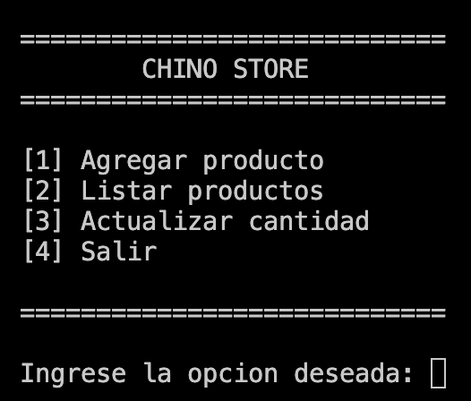

# 📌 CHINO STORE

> Programa para gestionar la tienda del chino

---

## 📖 Descripción

> Ayuda a mejorar el inventario de productos de una tienda

---

## 📑 Tabla de contenidos

* [Descripción](#-descripción)
* [Tecnologías utilizadas](#-tecnologías-utilizadas)
* [Requisitos previos](#-requisitos-previos)
* [Instalación](#-instalación)
* [Uso](#-uso)
* [Estructura del proyecto](#-estructura-del-proyecto)
* [Funcionalidades](#-funcionalidades)
* [Capturas de pantalla](#-capturas-de-pantalla)
* [Roadmap](#-roadmap)
* [Contribuciones](#-contribuciones)
* [Licencia](#-licencia)
* [Autor](#-autor)

---

## 🛠️ Tecnologías utilizadas

> Tecnologías usadas

* Python
* JSON

---

## ⚙️ Requisitos previos

Antes de ejecutar el proyecto, asegúrate de tener instalado:

* Python 3

---

## 🚀 Instalación

> Sigue estos pasos para instalar y ejecutar el proyecto:

```bash
# Clonar el repositorio
git clone (URL_DEL_REPOSITORIO)

# Entrar al directorio
cd Taller_2

# Ejecutar el proyecto
python main.py

```

---

## ▶️ Uso

> CHINO STORE

```bash
1. Registrar producto
2. Listar productos
3. Actualizar cantidad
```

---

## 📁 Estructura del proyecto

```bash
Taller_2/
│── add_product.py
│── edit_products.py
│── show_menu.py
│── show_products.py
│── select_option.py
│── productos.json
│── main.py
│── README.md
```

---

## ✨ Funcionalidades

* ✔️ Registrar productos
* ✔️ Listar productos
* ✔️ Actualizar cantidad

---

## 🖼️ Capturas de pantalla



```md
[Descripción de la imagen](image.png)
```
---
## ✅ Compartibilidad

| Windows | MacOS | Android |
| ------- | ----- | ------- |
| ✅ | ✅ | ❌ |

---

## 🧭 Roadmap / Mejoras futuras

* [ ] Eliminar productos
* [ ] Editar precio
* [ ] Mejorar interfaz

---

## 🤝 Contribuciones

Las contribuciones son bienvenidas.

1. Haz un fork del proyecto
2. Crea una nueva rama:

   ```bash
   git checkout -b feature/{{nombre}}
   ```
3. Realiza tus cambios y haz commit:

   ```bash
   git commit -m "Descripción del cambio"
   ```
4. Sube tus cambios:

   ```bash
   git push origin feature/{{nombre}}
   ```
5. Abre un Pull Request

---

## 📄 Licencia

>Educativa

---

## 👤 Autor

**Henry Abdiel Morales Galindo**

* GitHub: **Moraless0**
* Email: **moraless06@hotmail.com**